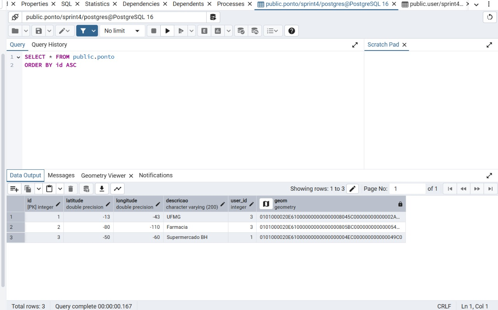
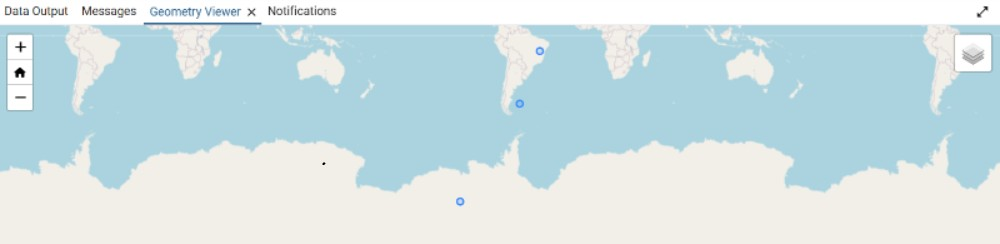
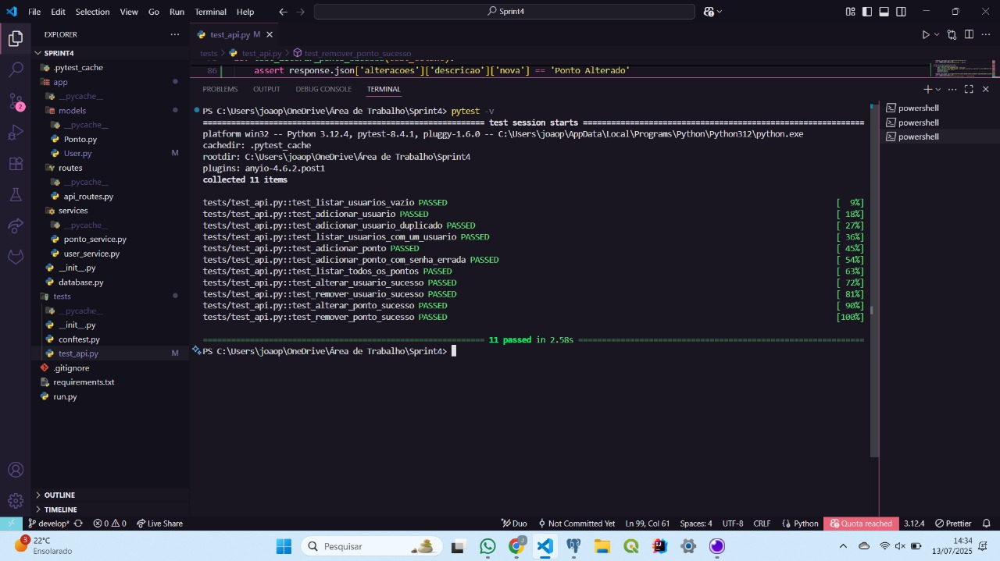

# Sprint 4: Backend de Geolocalização em Python

Desenvolvido por: **João Pedro Ferreira Lobo**

## 🔗 Redes

<a href="https://github.com/JoaoLoboIT" target="_blank"></a>
<a href="https://www.linkedin.com/in/joaoplobo" target="_blank"></a>

---

## 📌 Sobre o Projeto

Este projeto consiste em um backend robusto e completo, desenvolvido em **Python**, que serve como uma API para um serviço de geolocalização. A aplicação permite o cadastro, visualização, alteração e remoção de usuários e de pontos de interesse geográficos, cada um com sua latitude, longitude e descrição.

A arquitetura foi cuidadosamente planejada para ser escalável e organizada, seguindo padrões de mercado como o **design em camadas (Models, Services, Controllers/Routes)** e o padrão de projeto **Application Factory** com o uso de **Blueprints** do Flask.

## ✨ Principais Funcionalidades

-   **Gerenciamento de Usuários (CRUD):** API completa com endpoints para Adicionar, Listar, Alterar e Remover usuários.
-   **Gerenciamento de Pontos (CRUD):** API completa para Adicionar, Listar (todos e por usuário), Alterar e Remover pontos de interesse.
-   **Geolocalização com PostGIS:** Utilização da extensão espacial **PostGIS** para armazenamento e manipulação eficiente de dados geográficos, com uma coluna `geometry` dedicada.
-   **Autenticação por Requisição:** A API é "stateless", exigindo autenticação (email e senha) para operações sensíveis, como a criação e manipulação de pontos.
-   **Testes Automatizados:** O projeto inclui uma suíte de testes completa desenvolvida com **PyTest** para garantir a qualidade e a estabilidade do código.

## 🚀 Arquitetura e Tecnologias Utilizadas

A aplicação foi construída com um conjunto de tecnologias modernas e robustas, focando na organização e nas boas práticas de desenvolvimento.

-   **Linguagem:** **Python 3**
-   **Framework Backend:** **Flask**
-   **Banco de Dados:** **PostgreSQL**
-   **Extensão Espacial:** **PostGIS** para manipulação de dados geográficos.
-   **ORM (Object-Relational Mapper):** **SQLAlchemy** (com Flask-SQLAlchemy) para a interação com o banco de dados.
-   **ORM Espacial:** **GeoAlchemy2** para traduzir os tipos de dados do PostGIS para o Python.
-   **Driver do Banco:** **psycopg2-binary** para a comunicação entre Python e PostgreSQL.
-   **Testes:** **PyTest**

---

## ⚙️ Como Executar o Projeto Localmente

Siga os passos abaixo para configurar e rodar a aplicação no seu ambiente.

### Pré-requisitos
- Python 3.10+
- Git
- Um servidor PostgreSQL instalado e rodando com a extensão PostGIS habilitada.

### Passos

1.  **Clone o repositório:**
    ```bash
    git clone [https://github.com/JoaoLoboIT/sprint4terraLab.git](https://github.com/JoaoLoboIT/sprint4terraLab.git)
    cd sprint4terraLab
    ```

2.  **Crie e ative um ambiente virtual (recomendado):**
    ```bash
    # Cria o ambiente
    python -m venv venv

    # Ativa no Windows
    .\venv\Scripts\activate

    # Ativa no Linux/Mac
    source venv/bin/activate
    ```

3.  **Instale as dependências:**
    O arquivo `requirements.txt` contém todas as bibliotecas necessárias.
    ```bash
    pip install -r requirements.txt
    ```

4.  **Configure o Banco de Dados:**
    - Garanta que seu servidor PostgreSQL está rodando.
    - Crie um banco de dados vazio chamado `sprint4`.
    - Ative a extensão PostGIS nele com o comando SQL: `CREATE EXTENSION IF NOT EXISTS postgis;`
    - Abra o arquivo `config.py` e ajuste a senha do PostgreSQL na linha `SQLALCHEMY_DATABASE_URI` se necessário.

5.  **Inicie a Aplicação:**
    Use o `run.py` para iniciar o servidor Flask. As tabelas serão criadas automaticamente na primeira vez.
    ```bash
    python run.py
    ```
    O servidor estará rodando em `http://127.0.0.1:8080`.

---

## 🛠️ Guia Rápido da API (Endpoints)

A API foi projetada para ser consumida por ferramentas como Insomnia ou Postman. A maioria das rotas que criam ou modificam dados exigem autenticação via parâmetros na URL.

### Endpoints de Usuário

#### `POST /AdicionarUsuario`
-   **O que faz:** Cria um novo usuário.
-   **URL:** `http://127.0.0.1:8080/AdicionarUsuario`
-   **Parâmetros (Query):**
    -   `email`: (ex: `novo.usuario@email.com`)
    -   `senha`: (ex: `senha123`)

#### `GET /ListarUsuarios`
-   **O que faz:** Retorna uma lista de todos os usuários cadastrados.
-   **URL:** `http://127.0.0.1:8080/ListarUsuarios`
-   **Parâmetros (Query):** Nenhum.

#### `POST /AlterarUsuario`
-   **O que faz:** Altera o email e/ou a senha de um usuário existente.
-   **URL:** `http://127.0.0.1:8080/AlterarUsuario`
-   **Parâmetros (Query):**
    -   `email_atual` (obrigatório): O email atual do usuário a ser modificado.
    -   `senha_atual` (obrigatório): A senha atual para autorizar a mudança.
    -   `novo_email` (opcional): O novo email para o usuário.
    -   `nova_senha` (opcional): A nova senha para o usuário.

#### `POST /RemoverUsuario`
-   **O que faz:** Remove um usuário e todos os seus pontos associados.
-   **URL:** `http://127.0.0.1:8080/RemoverUsuario`
-   **Parâmetros (Query):** Um dos dois abaixo.
    -   `id`: O ID do usuário a ser removido.
    -   OU `email`: O email do usuário a ser removido.

---
### Endpoints de Ponto Geográfico

#### `POST /AdicionarPonto`
-   **O que faz:** Cria um novo ponto geográfico para um usuário autenticado.
-   **URL:** `http://127.0.0.1:8080/AdicionarPonto`
-   **Parâmetros (Query):**
    -   `email`: O email do usuário dono do ponto.
    -   `senha`: A senha do usuário para autenticação.
    -   `latitude`: A latitude do ponto.
    -   `longitude`: A longitude do ponto.
    -   `descricao`: O texto descritivo do ponto.

**Exemplo de Visualização Espacial (PostGIS):**



**Clicando no mapa...**



#### `GET /ListarPontos`
-   **O que faz:** Lista todos os pontos de um usuário específico.
-   **URL:** `http://127.0.0.1:8080/ListarPontos`
-   **Parâmetros (Query):** Um dos dois abaixo.
    -   `id`: O ID do usuário.
    -   OU `email`: O email do usuário.

#### `GET /ListarTodosPontos`
-   **O que faz:** Retorna uma lista de todos os pontos de todos os usuários com as informações de seus autores.
-   **URL:** `http://127.0.0.1:8080/ListarTodosPontos`
-   **Parâmetros (Query):** Nenhum.

#### `POST /AlterarPonto`
-   **O que faz:** Altera os dados de um ponto existente. Requer autenticação do dono.
-   **URL:** `http://127.0.0.1:8080/AlterarPonto`
-   **Parâmetros (Query):**
    -   `id` (obrigatório): O ID do ponto a ser alterado.
    -   `user` (obrigatório): O email do dono do ponto.
    -   `senha` (obrigatório): A senha do dono do ponto.
    -   `latitude` (opcional): A nova latitude.
    -   `longitude` (opcional): A nova longitude.
    -   `descricao` (opcional): A nova descrição.

#### `POST /RemoverPonto`
-   **O que faz:** Remove um ponto específico. Requer autenticação do dono.
-   **URL:** `http://127.0.0.1:8080/RemoverPonto`
-   **Parâmetros (Query):**
    -   `id` (obrigatório): O ID do ponto a ser removido.
    -   `user` (obrigatório): O email do dono do ponto.
    -   `senha` (obrigatório): A senha do dono do ponto.

---

## 📄 Demonstração da API

[Prints_Insomnia](images/PrintsSprint4.pdf)

## 🧪 Testes Automatizados

O projeto possui uma suíte de testes completa para garantir o funcionamento de todos os endpoints da API.

-   **Framework:** **PyTest**
-   **Como Rodar os Testes:**
    No terminal, na raiz do projeto, execute o comando:
    ```bash
    pytest -v
    ```
    O `-v` (verbose) mostra o resultado de cada teste individualmente.

**Resultado Esperado dos Testes:**



<br>